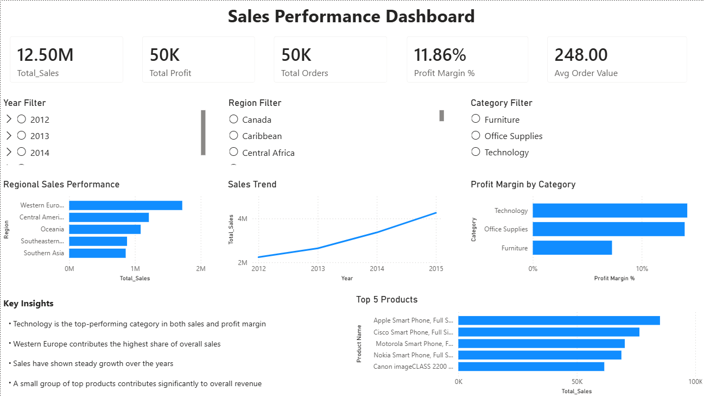

# 📊 Sales Performance Dashboard

## 📌 Overview
This project presents a Sales Performance Dashboard built using Power BI to analyze business performance across categories, regions, and time.

---

## 🎯 Objectives
- Track overall sales, profit, and order volume  
- Identify top-performing categories and regions  
- Analyze sales trends over time  
- Evaluate profitability using key metrics  

---

## 🛠 Tools Used
- Power BI  
- DAX  

---

## 📈 Features
- KPI cards (Total Sales, Profit, Orders, Profit Margin, Avg Order Value)  
- Interactive slicers (Year, Region, Category)  
- Sales trend analysis  
- Regional performance comparison  
- Top 5 products analysis  
- Profit margin analysis  

---

## 🔍 Key Insights
- Technology is the top-performing category in both sales and profit margin  
- Western Europe contributes the highest share of overall sales  
- Sales have shown steady growth over the years  
- A small group of top products contributes significantly to overall revenue  

---

## 📸 Dashboard Preview

